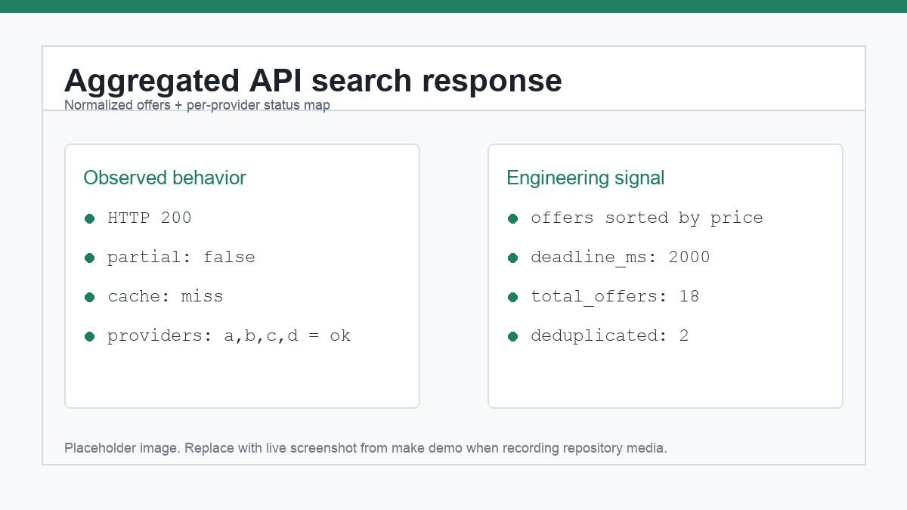
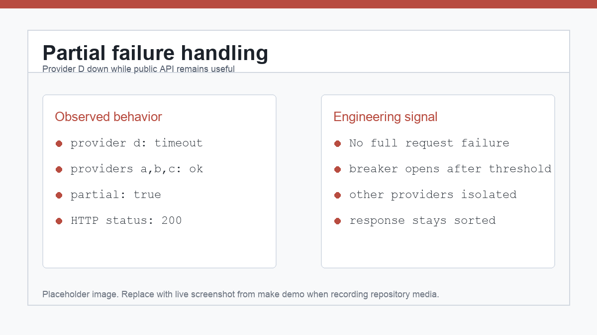
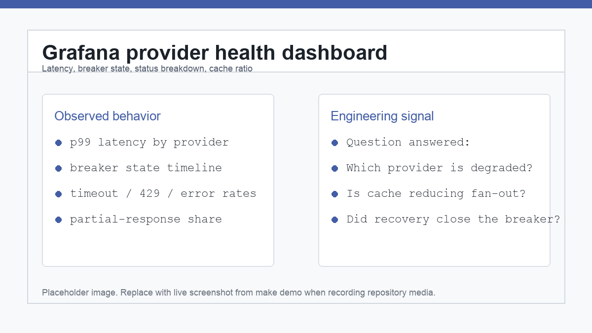
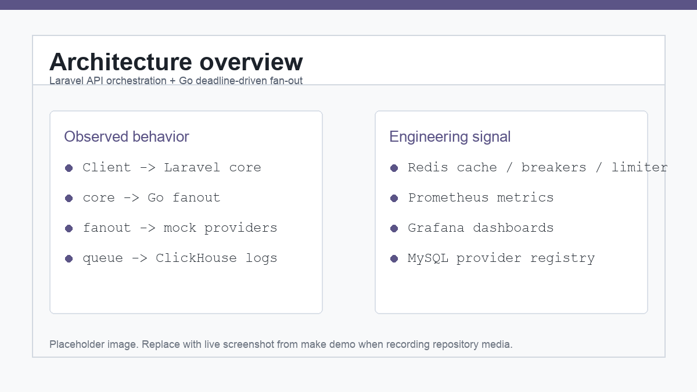
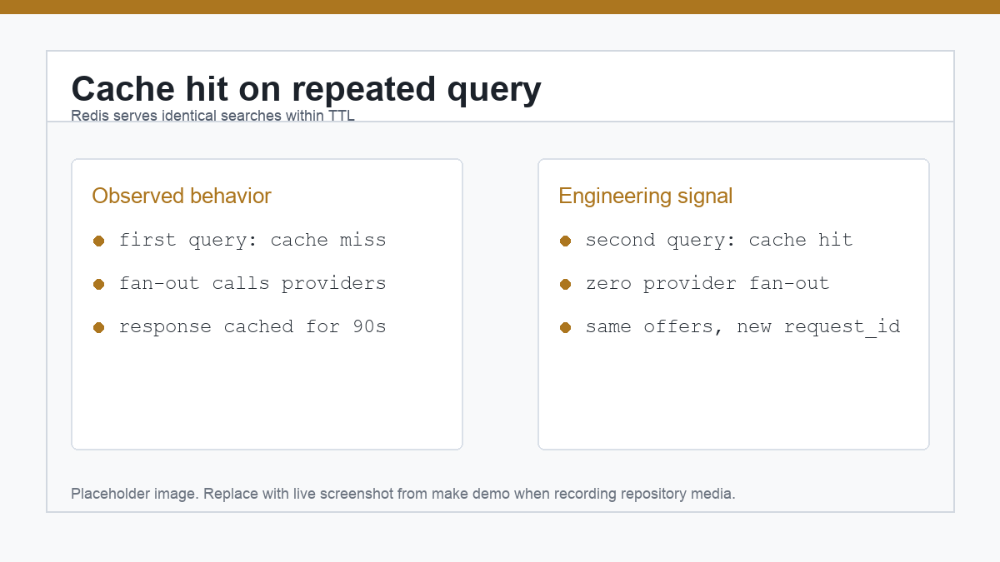

# mini-FireFly — Resilient Flight Provider Aggregation Platform

Production-style backend system that aggregates flight offers from multiple unreliable providers.

The project demonstrates:
- Laravel API orchestration
- Go-based concurrent fan-out
- Redis caching and rate limiting
- ClickHouse analytics logging
- queue-based asynchronous writes
- circuit breakers and retries
- partial failure handling
- provider health monitoring
- Prometheus/Grafana observability
- CI with tests, linters, and static analysis

The core engineering problem is not flight search itself. The goal is to model a realistic integration layer where external providers are slow, inconsistent, malformed, rate-limited, or temporarily unavailable — while the public API still returns a useful response within a hard deadline.


`mini-FireFly` is a production-style simulation, not a real airline integration. It uses mock providers to make provider slowness, malformed payloads, 429s, 500s, timeouts, and recovery deterministic and reviewable.

[SPEC.md](SPEC.md) is the detailed engineering specification. Architecture decisions live in
[docs/ARCHITECTURE_DECISIONS.md](docs/ARCHITECTURE_DECISIONS.md), operational procedures in
[RUNBOOK.md](RUNBOOK.md), testing strategy in [docs/TESTING.md](docs/TESTING.md), observability
notes in [docs/OBSERVABILITY.md](docs/OBSERVABILITY.md), and a rehearsed incident writeup in
[POSTMORTEM.md](POSTMORTEM.md).

## What this project demonstrates

### Aggregated search response



The public API returns normalized offers from multiple providers, sorted by price and departure time, together with a per-provider status map.

### Provider failure handling



When one provider is down or slow, the API returns partial results instead of failing the entire request.

### Provider health dashboard



Grafana shows provider latency, status breakdown, breaker state, cache hit ratio, and error trends.

## Stack

| Concern | Tech |
|---|---|
| Core API / orchestration | PHP 8.3, Laravel 11 (`core/`) |
| Concurrent fan-out | Go ≥ 1.22 (`fanout/`) |
| Mock providers (chaos rig) | Go ≥ 1.22 (`mockprovider/`) |
| Durable storage | MySQL 8 |
| Hot state / cache | Redis 7 |
| Analytics / call log | ClickHouse ≥ 24.x |
| Metrics / dashboards | Prometheus + Grafana (`deploy/`) |

## Architecture



```
                 ┌─────────────────────────────────────────────────────────┐
                 │                      docker compose                      │
                 │                                                          │
 ┌────────┐      │  ┌────────────┐  HTTP   ┌─────────────┐   HTTP  ┌──────┐ │
 │ Client ├──────┼─►│  core      ├────────►│  fanout     ├────────►│mock-a│ │
 └────────┘ HTTP │  │ (Laravel)  │ /v1/    │  (Go)       │         ├──────┤ │
                 │  │            │ fanout  │             ├────────►│mock-b│ │
                 │  │ - REST API │         │ - goroutine │         ├──────┤ │
                 │  │ - validate │         │   per       ├────────►│mock-c│ │
                 │  │ - cache    │         │   provider  │         ├──────┤ │
                 │  │ - idempot. │         │ - breakers  ├────────►│mock-d│ │
                 │  │ - merge/   │         │ - retries   │         └──────┘ │
                 │  │   sort     │         │ - rate lim  │                  │
                 │  └─┬───┬───┬──┘         └──┬───────┬──┘                  │
                 │    │   │   │               │       │ /metrics            │
                 │    ▼   ▼   ▼               ▼       ▼                     │
                 │ ┌─────┐┌─────┐┌──────────┐┌─────┐ ┌──────────┐          │
                 │ │MySQL││Redis││ClickHouse││Redis│ │Prometheus│          │
                 │ └─────┘└─────┘└──────────┘└─────┘ └────┬─────┘          │
                 │                  ▲  (breaker/limiter    ▼                │
                 │  provider_calls  │   state, Lua)      ┌───────┐          │
                 │  (written by core)└───────────────────│Grafana│          │
                 │                                       └───────┘          │
                 └─────────────────────────────────────────────────────────┘
```

A `core-queue` worker (same image as `core`, `command: queue`) drains the Redis-backed
Laravel queue and performs the async ClickHouse `provider_calls` inserts.

### Request lifecycle (`POST /api/v1/search`)

1. **core** validates + normalizes the body (IATA uppercase, date bounds, passenger 1–9).
2. Computes `cache_key = sha256(canonical_json(query))`. Redis hit → return with `"cache":"hit"`.
3. Loads enabled providers from MySQL.
4. Calls **fanout** `POST /v1/fanout` with the query, the per-provider config rows, and a
   deadline budget (`SEARCH_DEADLINE_MS=2000` minus elapsed minus a 100 ms merge reserve).
5. **fanout** runs one goroutine per provider: breaker → limiter → bulkhead → adapter
   (per-attempt timeout, retry transient failures) → record breaker outcome → emit to a
   buffered channel. **It never blocks past the deadline.**
6. **core** merges, dedups (§4.4), sorts `price ASC, depart_at ASC, provider ASC`, caches
   the response (TTL 90 s, only if ≥ 1 provider returned `ok`), and dispatches the
   ClickHouse logging job. A slow/dead provider yields `"partial": true`, never a failure.

## Quickstart

Requires Docker + Docker Compose v2. No local Go or PHP toolchain needed — everything
builds and runs in containers. `jq` is required for `make demo` because the demo verifies
JSON response fields.

```sh
make up      # compose up -d --wait, then run migrations + seed providers a–d
```

`make up` prints the service URLs:

| Service | URL |
|---|---|
| core (public API) | http://localhost:8000/api/v1 |
| fanout metrics | http://localhost:8090/metrics |
| Prometheus | http://localhost:9090 |
| Grafana | http://localhost:3000 (admin/admin) — dashboard **Provider Health** |

Mock providers publish host ports `8081`–`8084` (`mock-a`→8081 … `mock-d`→8084).

Run a baseline search:

```sh
curl -s -X POST http://localhost:8000/api/v1/search \
  -H 'Content-Type: application/json' \
  -d '{"origin":"BEG","destination":"AMS","depart_date":"2026-07-01","passengers":1}' | jq
```

You get `"cache":"miss"`, `"partial":false`, offers from all four providers (prices
normalized to EUR, sorted cheapest-first), and a `providers` status map. Re-run the
identical query within 90 s and it returns `"cache":"hit"` with zero fan-out.

Run the guided demo (healthy → incident → recovery → booking, < 3 min):

```sh
make demo
```

Tear down (removes volumes):

```sh
make down
```

### Make targets

```
make up           # compose up -d --wait, run migrations + seed
make down         # compose down -v
make test         # unit tests (PHP + Go), no containers
make itest        # integration suite I1–I8 against the running stack
make lint         # pint + phpstan (PHP), gofmt + go vet (Go)
make seed         # reseed providers a–d
make chaos-flaky P=b   # set mock-b to 'flaky'
make chaos-slow  P=b   # set mock-b to 'slow'
make chaos-down  P=d   # set mock-d to 'down'
make chaos-reset       # all mocks back to 'stable'
make demo         # scripted walkthrough
make load         # k6 load smoke (50 RPS x 60s vs /search, §14.4)
make logs / ps / config
```

## Demo walkthrough (`scripts/demo.sh`)

`make demo` runs ten scripted, narrated checks against the live stack (open the
**Provider Health** dashboard in Grafana to watch it live). It exits non-zero if an expected
behavior is missing.

1. **Healthy baseline search** — all providers healthy → HTTP 200, `cache:miss`, `partial:false`.
2. **Cache hit on repeated query** — same query within TTL → HTTP 200, `cache:hit`.
3. **Slow provider scenario** — provider b is set to `slow`; the public API remains bounded.
4. **Down provider scenario** — provider d is set to `down`; d reports `timeout`, `error`, or `breaker_open`.
5. **Circuit breaker opening** — repeated unique searches drive d to `breaker_open`.
6. **Partial result response** — the API still returns HTTP 200 with `partial:true`.
7. **Provider recovery** — provider d is restored to `stable`.
8. **Circuit breaker closing** — after cooldown, a successful probe returns d to `ok`.
9. **Booking creation** — first `POST /bookings` returns 201 with a `bk_` id.
10. **Idempotent booking replay** — same key and body return 200 with `Idempotency-Replayed: true`.



Verified behavior is also covered by the integration suite (`tests/integration/i1_*.sh` through
`i8_*.sh`).

## API documentation

OpenAPI specification is available in [`docs/openapi.yaml`](docs/openapi.yaml).

## Quality gates

| Area | Tool |
|---|---|
| PHP tests | PHPUnit / Laravel test runner |
| PHP style | Laravel Pint |
| PHP static analysis | PHPStan |
| Go tests | go test |
| Go formatting | gofmt |
| Go static checks | go vet |
| Integration tests | Docker Compose CI stack |
| Observability | Prometheus + Grafana |

## Design decisions

### Two languages on purpose (Go + PHP)

The split is deliberate, not accidental. **Go** owns the concurrent fan-out: one goroutine
per provider, channels for result collection, a single request-scoped `context` deadline
that every in-flight HTTP call rides — this is what Go's runtime is best at, and it keeps
the "never block past the deadline" guarantee cheap and leak-free (verified with goleak).
**PHP/Laravel** owns the request/response surface: validation, the provider registry CRUD,
Redis caching, idempotent bookings, Eloquent persistence, and the queued ClickHouse
logging — areas where Laravel's batteries-included ergonomics shine. The boundary is a
single internal HTTP contract (`POST /v1/fanout`, SPEC §9), so each side stays idiomatic.

### Static FX table (no FX feed)

Currencies on the wire vary by provider (A/D: EUR, B: USD cents, C: RSD strings).
Normalization converts everything to **EUR** using a fixed table baked into fanout config:

| From | To EUR | rate |
|---|---|---|
| EUR | EUR | 1.0 |
| USD | EUR | **0.92** (`FX_USD_EUR`) |
| RSD | EUR | **0.0085** (`FX_RSD_EUR`) |

Static **on purpose**: a real FX feed is an external dependency with its own latency,
outages, and rate limits — exactly the kind of failure this project is *not* about. The
rates live in env (`FX_USD_EUR` / `FX_RSD_EUR`, defaults above) and are injected into every
adapter at registry wire-up, so one config flows to all providers. Determinism is a feature:
fixed rates make golden-file normalization tests and cached responses reproducible.

### Fail-open breakers & limiter on Redis down

Breaker and rate-limiter state live in Redis (atomic Lua scripts, shared so two fanout
replicas can't both probe). If **Redis is unreachable, both fail OPEN**: `Breaker.Allow`
returns `true`, `Breaker.Record` is a no-op, and `Limiter.Allow` returns `true` — and each
logs loudly via a `FailLogger` so an operator sees it. The reasoning: Redis being down is
*our* infrastructure failing, and the safe default is to let traffic reach providers
(degraded: no breaker protection, no client-side rate limiting) rather than fail every
search. The cache simply misses, and breakers resume protecting once Redis returns. This is
implemented in `fanout/internal/breaker/breaker.go` and `fanout/internal/limiter/limiter.go`.

### Partial results are a success mode

One slow or dead provider must never fail the whole request. fanout returns whatever
arrived by the deadline plus a per-provider status map; providers that never reported are
marked `timeout`, not omitted. core sets `"partial": true` whenever any provider's status
∉ `{ok}`, still returns **HTTP 200** (even with `offers: []` if all failed), and caches only
when ≥ 1 provider returned `ok`. HTTP 5xx is reserved for the aggregator's *own* faults.
Per-provider statuses: `ok | timeout | error | rate_limited | breaker_open | bad_payload | skipped_disabled`.

### Other simplifications (documented)

- **Bookings don't persist offers.** A booking stores the `offer_id` string + a passenger
  snapshot and is `status=confirmed` immediately — no real ticketing. Unknown `offer_id`
  format → 422.
- **Mock providers are deliberately hostile fakes** (latency, 500s, truncated JSON,
  connection drops, 429s) selected by `CHAOS_PROFILE`. There is no real airline/GDS API.

## Demo-grade security simplifications

This is a single-tenant demo. The following are **intentional** and must not be mistaken for
production posture (SPEC §19):

- **No authentication / authorization** on the public API. No API key, no tenancy.
- **No TLS inside compose.** All inter-service traffic is plaintext HTTP on the internal
  Docker network; host ports are bound only for inspection.
- **Secrets via env.** DB passwords and the like are passed as plain environment variables
  in `docker-compose.yml` — no secret manager, no rotation.
- Grafana ships with the default `admin/admin` credentials.

## ClickHouse analytics queries

Every provider call attempt set is logged (async, loss-tolerant) to
`firefly.provider_calls`. Canonical queries (`http://localhost:8123`, db `firefly`):

A cache hit logs one row per provider with `cache_hit = 1` (latency/attempts 0) so the
cache-hit-ratio is meaningful; the provider-performance queries therefore filter
`cache_hit = 0` to count only real provider calls, while the ratio query spans all rows.

```sql
-- p99 latency per provider, 5m buckets (real calls only)
SELECT provider, toStartOfFiveMinutes(ts) AS t, quantile(0.99)(latency_ms) AS p99
FROM firefly.provider_calls WHERE ts > now() - INTERVAL 6 HOUR AND cache_hit = 0
GROUP BY provider, t ORDER BY t;

-- error-rate breakdown (real calls only)
SELECT provider, status, count() AS c
FROM firefly.provider_calls WHERE ts > now() - INTERVAL 1 HOUR AND cache_hit = 0
GROUP BY provider, status;

-- cache hit ratio over time (all rows: hits + misses)
SELECT toStartOfFiveMinutes(ts) AS t, avg(cache_hit) AS hit_ratio
FROM firefly.provider_calls GROUP BY t ORDER BY t;
```

Run one from the host:

```sh
curl -s "http://localhost:8123/?query=$(python3 -c 'import urllib.parse,sys;print(urllib.parse.quote(sys.argv[1]))' \
"SELECT provider, status, count() AS c FROM firefly.provider_calls WHERE ts > now() - INTERVAL 1 HOUR GROUP BY provider, status FORMAT PrettyCompact")"
```

The error-rate and cache-hit queries also back the Grafana **Status breakdown** and
**Cache hit ratio (ClickHouse)** panels.

## Adding a provider

The whole point of the design: a new provider is **one adapter package + one registry
entry + one config row**. Verified against the actual code (`fanout/internal/adapter`,
`fanout/internal/providers`, `core/database/seeders/ProviderSeeder.php`). Steps (≤ 10):

1. **Create the adapter package** `fanout/internal/providers/e/e.go` with `package e` and a
   constant `const providerID = "e"`.
2. **Define the wire struct(s)** for provider E's native response format and a
   `parse([]byte) ([]model.Offer, error)` that unmarshals it. Mirror an existing adapter
   that matches E's shape (A = flat JSON, B = nested/epoch/cents, C = stringly-typed
   local-time, D = NDJSON).
3. **Implement the `adapter.Adapter` interface** — an `Adapter` struct holding
   `{cfg adapter.ProviderConfig; client *http.Client; fx normalize.FX}`, plus `Name() string`
   returning `providerID` and `Search(ctx, model.Query) ([]model.Offer, error)`. In `Search`,
   build the request, call `normalize.DoSearch(ctx, client, baseURL+"/search", ...)`, then
   `parse` the raw bytes.
4. **Provide both constructors**: `New(cfg adapter.ProviderConfig) adapter.Adapter` (uses
   `normalize.DefaultFX()`) and `NewWithDeps(cfg, client *http.Client, fx normalize.FX)
   adapter.Adapter` (the FX-injecting form the registry calls). Copy the pattern from `a.go`.
5. **Normalize with the shared helpers** in your `parse`: `fx.ToEUR(amount, currency)` for
   money, `normalize.ParseEpochUTC` / `normalize.ParseLocalCETime(s, loc)` (+
   `normalize.Location(iata)`) for times, and `normalize.Assemble(providerID, nativeID,
   priceEUR, segments)` to compute `offer_id`, `stops`, and `duration_minutes`. Wrap parse
   failures in `adapter.ErrBadPayload` and transport/5xx in the sentinel errors so retry and
   the breaker behave correctly (`ErrTimeout`/`ErrUpstream` retryable; `ErrRateLimited`/
   `ErrBadPayload` not, and they don't trip the breaker).
6. **Register it**: add one line to `NewRegistry` in
   `fanout/internal/providers/registry.go` — `"e": withFX(e.NewWithDeps, fx),` — plus the
   import `"github.com/mini-firefly/fanout/internal/providers/e"`.
7. **Add the DB row**: add `'e' => 'http://mock-e:8080'` to `$providers` in
   `core/database/seeders/ProviderSeeder.php` (defaults give timeout 800 ms, rate-limit 40,
   breaker threshold 5 / window 30 s / cooldown 15 s). This is what makes fanout
   config-stateless — provider config flows from MySQL on every request.
8. **Wire a backing service** (only if it's a new mock): add a `mock-e` block to
   `docker-compose.yml` with `PROVIDER_ID: e`. No new Prometheus scrape is needed — fanout
   already emits per-provider metrics keyed by the `provider` label.
9. **Add golden-file tests** `e_test.go` (valid / truncated / wrong-currency / empty
   payloads) alongside the existing `a_test.go`…`d_test.go`.
10. **Re-seed and verify**: `make seed`, then run a search — provider `e` appears in the
    `providers` status map and in `GET /api/v1/providers`, and its row shows on the Grafana
    dashboard automatically (panels key off the `provider` label).

No changes to the fan-out core, breaker, limiter, retry, or bulkhead are required — those
operate uniformly on every registered provider.

## Repository hygiene

Issue templates, a pull request template, Dependabot, and recommended labels are included
under `.github/` and [docs/GITHUB_LABELS.md](docs/GITHUB_LABELS.md). New work should use the
templates to make acceptance criteria, testing notes, documentation impact, and failure
behavior explicit.

## Continuous integration

`.github/workflows/ci.yml` runs on every PR and push to `main`:
`lint` → `unit` → `security` → `integration` → `build & push` → `deploy` (optional).

- **lint** — Composer validation, Pint, and PHPStan (PHP); gofmt, `go vet`, and golangci-lint (version pinned;
  config in each module's `.golangci.yml`: standard set + `errcheck` + `gocritic`).
- **unit** — Composer validation and `php artisan test` against a real Redis service (so the idempotency Feature
  tests run instead of self-skipping) and `go test -race` for both Go modules.
- **security** — Trivy filesystem scan (vulnerable deps, leaked secrets, Dockerfile
  misconfig), report-only by default. Dependabot (`.github/dependabot.yml`) opens weekly
  update PRs for Go modules, Composer, Actions, and base images.
- **integration** — brings the compose stack up (`--wait`) and runs the I1–I8 suite.
- **build & push** — buildx with a GHA layer cache builds all three images and pushes to
  GHCR on `main` (tagged with full SHA, short SHA, and `latest`).
- **deploy** — optional, environment-gated SSH deploy; no-ops until the VPS secrets are set.

Concurrent runs on the same ref are auto-cancelled.

**Branch protection (recommended):** require the `lint`, `unit`, and `integration` checks
to pass before merging to `main` (Settings → Branches → Add rule) — CI green is the merge bar.

### Load smoke (optional, SPEC §14.4)

`make load` runs a [k6](https://k6.io) script (`tests/load/smoke.js`): 50 RPS × 60s against
`/search`, asserting p99 < deadline + 200 ms and zero 5xx. Set mixed chaos first for a
realistic picture (`make chaos-slow P=b && make chaos-flaky P=c`, then `make chaos-reset`).

> `core` runs the single-worker `php artisan serve` dev server, which serializes requests —
> fine for the demo, but a sustained 50-RPS run needs a concurrent front (php-fpm + nginx) to
> measure the aggregator rather than the server. For the dev server, lower the rate:
> `make load RPS=10 DURATION=20s`.

## Repository layout

```
core/         Laravel core API (search, bookings, cache, idempotency, CH logging job)
fanout/       Go fan-out service (adapters, breakers, retries, limiter, bulkhead)
mockprovider/ Go mock providers (deterministic offers + chaos injection)
fixtures/     airports.json, routes.json (frozen shared contracts)
deploy/       prometheus / grafana / clickhouse provisioning
scripts/      seed.sh, chaos.sh, demo.sh, itest.sh
RUNBOOK.md    incident response procedures (4 scenarios)
POSTMORTEM.md rehearsed-incident writeup (blameless)
SPEC.md       engineering specification (source of truth)
```
